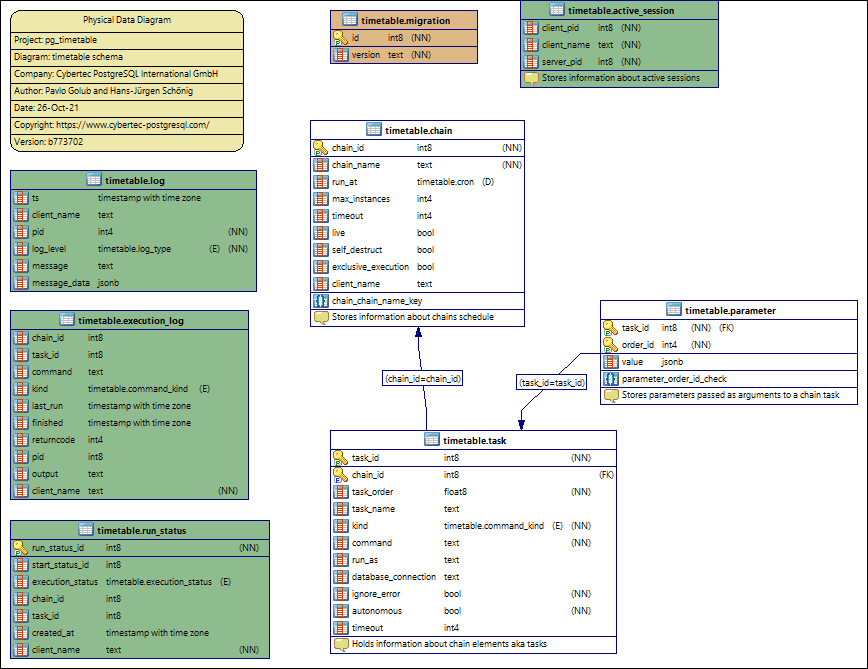

# Database Schema

**pg_timetable** is a database driven application. During the first start the necessary schema is created if absent.

## Main tables and objects

```sql
--8<-- "internal/pgengine/sql/ddl.sql"
```

## Jobs related functions

```sql
--8<-- "internal/pgengine/sql/job_functions.sql"
```

### `timetable.add_job()` Parameters

Creates a simple one-task chain

**Returns:** `BIGINT`

#### Parameters

| Parameter | Type | Description | Default |
|-----------|------|-------------|---------|
| `job_name` | `text` | The unique name of the **chain** and **command** | Required |
| `job_schedule` | `timetable.cron` | Time schedule in сron syntax at Postgres server time zone | Required |
| `job_command` | `text` | The SQL which will be executed | Required |
| `job_parameters` | `jsonb` | Arguments for the chain **command** | `NULL` |
| `job_kind` | `timetable.command_kind` | Kind of the command: *SQL*, *PROGRAM* or *BUILTIN* | `SQL` |
| `job_client_name` | `text` | Specifies which client should execute the chain. Set this to `NULL` to allow any client | `NULL` |
| `job_max_instances` | `integer` | The amount of instances that this chain may have running at the same time | `NULL` |
| `job_live` | `boolean` | Control if the chain may be executed once it reaches its schedule | `TRUE` |
| `job_self_destruct` | `boolean` | Self destruct the chain after execution | `FALSE` |
| `job_ignore_errors` | `boolean` | Ignore error during execution | `TRUE` |
| `job_exclusive` | `boolean` | Execute the chain in the exclusive mode | `FALSE` |

**Returns:** the ID of the created chain

## Сron related functions

```sql
--8<-- "internal/pgengine/sql/cron.sql"
```

## ER-Diagram


