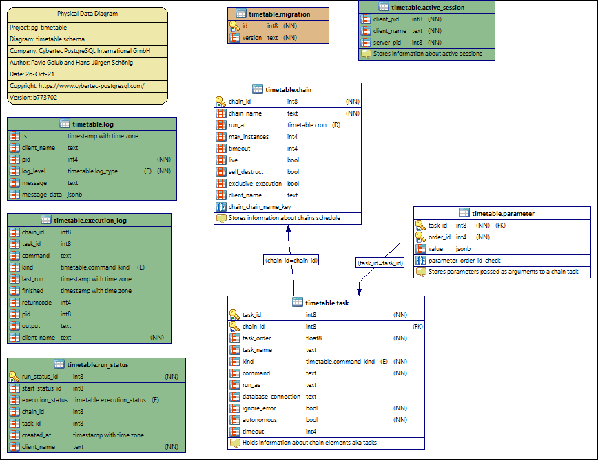

Database Schema
========================================

.. literalinclude:: ../internal/pgengine/sql/ddl.sql
    :linenos:
    :caption: Main tables and objects
    :language: SQL

.. literalinclude:: ../internal/pgengine/sql/job_functions.sql
    :linenos:
    :caption: Jobs related functions
    :language: SQL

.. literalinclude:: ../internal/pgengine/sql/cron_functions.sql
    :linenos:
    :caption: cron related functions
    :language: SQL

.. literalinclude:: ../internal/pgengine/sql/tasks.sql
    :linenos:
    :caption: Builtin tasks definition
    :language: SQL
    
