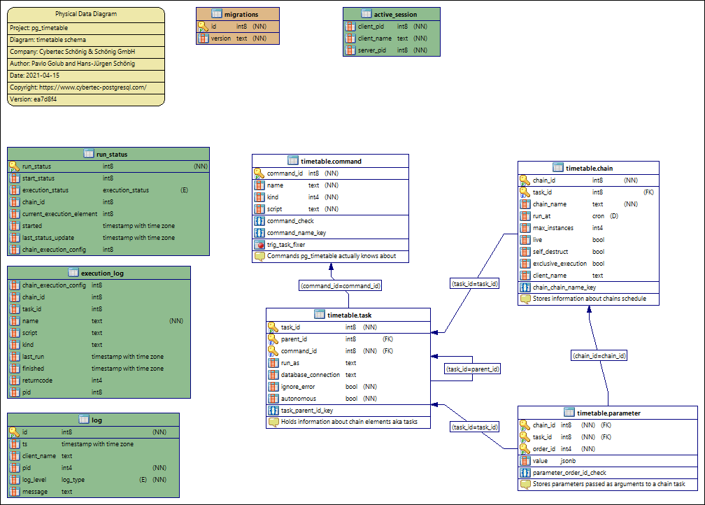

Database Schema
========================================

Main tables and objects
~~~~~~~~~~~~~~~~~~~~~~~~~~~~~~~~~~~~~~~

.. literalinclude:: ../internal/pgengine/sql/ddl.sql
    :linenos:
    :language: SQL

Jobs related functions
~~~~~~~~~~~~~~~~~~~~~~~~~~~~~~~~~~~~~~~

.. literalinclude:: ../internal/pgengine/sql/job_functions.sql
    :linenos:
    :language: SQL

Сron related functions
~~~~~~~~~~~~~~~~~~~~~~~~~~~~~~~~~~~~~~~

.. literalinclude:: ../internal/pgengine/sql/cron_functions.sql
    :linenos:
    :language: SQL

Builtin tasks definition
~~~~~~~~~~~~~~~~~~~~~~~~~~~~~~~~~~~~~~~

.. literalinclude:: ../internal/pgengine/sql/tasks.sql
    :linenos:
    :language: SQL

ER-Diagram
~~~~~~~~~~~~~~~~~~~~~~~~~~~~~~~~~~~~~~~

    ER-Diagram